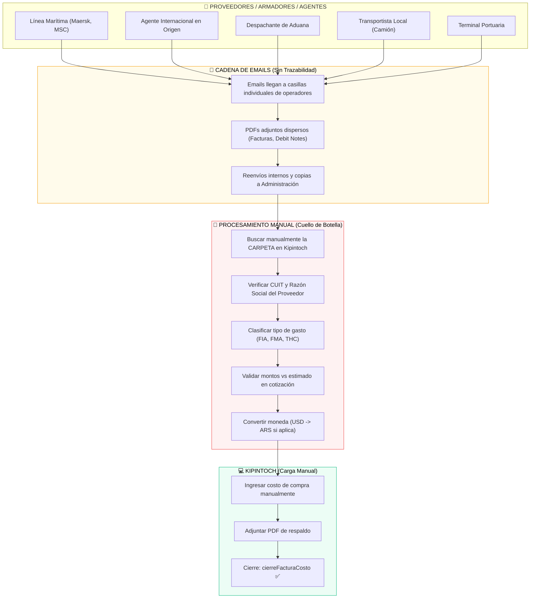
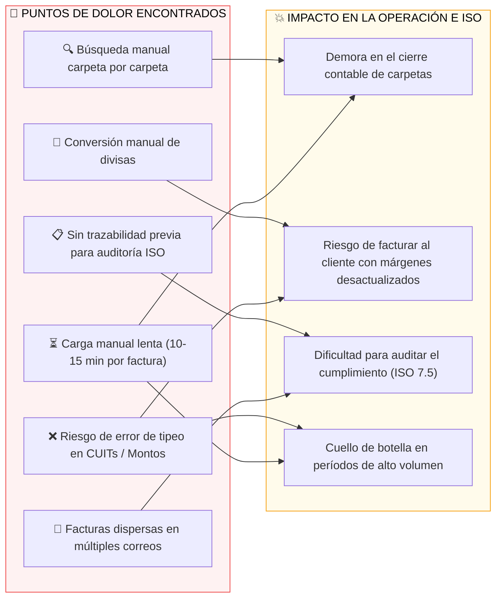
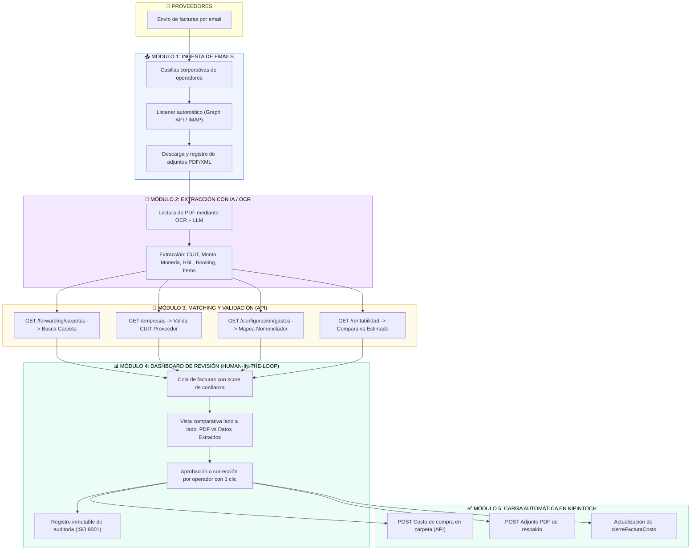
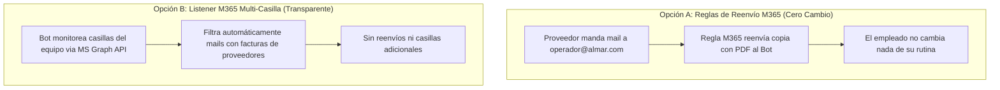
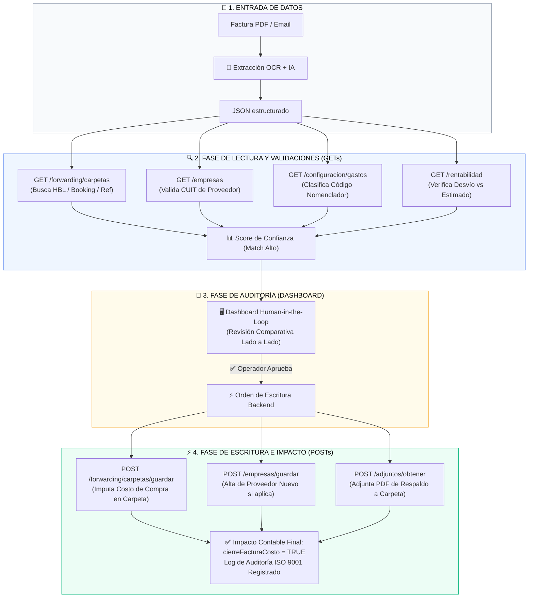
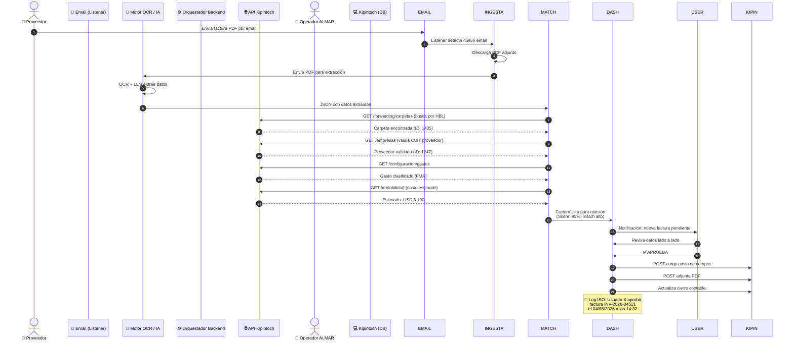
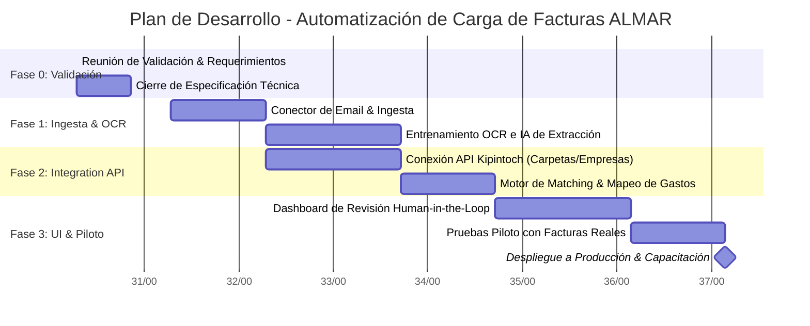

# 🚀 Presentación Ejecutiva: Automatización de Carga de Facturas
## ALMAR Rosario — Proyecto de Integración API Kipintoch & ISO 9001
**Fecha:** 4 de agosto de 2026 | **Presentador:** Fran Bondino | **Versión:** 1.0

---

## 📌 ESTRUCTURA DE LA PRESENTACIÓN DE APERTURA

```
 1. Objetivo y Alcance    ➔ 2. Flujo AS-IS / Dolores ➔ 3. Arquitectura TO-BE ➔ 4. Integración API GET/POST
 5. Manejo de Mails (A/B/C) ➔ 6. Casos de Borde     ➔ 7. Accesos a Pedir    ➔ 8. Handoff a ISO 9001
```

---

## SLIDE 1: Objetivo y Alcance del Proyecto

### 🎯 ¿Qué Venimos a Resolver Hoy?

* **El Problema:** La carga de facturas de costos de proveedores (armadores, despachantes, fletes locales) se realiza mediante un proceso manual, lento y desestructurado a través de cadenas de emails informales.
* **La Solución:** Un bot inteligente que capta las facturas entrantes, lee los PDFs mediante IA/OCR, valida los datos contra la API de Kipintoch y los presenta en un **Dashboard de 1-Clic** para aprobación rápida del operador.
* **El Principio de Diseño:** **"Humano en el Loop" (Human-in-the-Loop)**. El bot realiza el 90% del trabajo pesado (lectura, clasificación y matcheo), pero la aprobación final la realiza el personal autorizado de ALMAR.

> [!IMPORTANT]
> **Foco Clave:** Todo el valor del desarrollo está en optimizar el tramo previo a Kipintoch. Una vez aprobado en el Dashboard, la API inyecta el costo de compra y el PDF de respaldo en la carpeta de forma automática e inmutable (cumpliendo ISO 9001:2015).

---

## SLIDE 2: Diagnóstico del Flujo Actual (AS-IS) & Puntos de Dolor

### 🔄 2.1 Flujo Operativo Actual (Sin Automatización)



### ⚠️ 2.2 Mapa de Dolor e Impacto Operativo



---

## SLIDE 3: Arquitectura Propuesta (TO-BE) en 5 Módulos



---

## SLIDE 4: Manejo de Casillas Descentralizadas (Móduo 1)

Sabemos que en ALMAR **no existe una casilla centralizada**, sino que cada operador recibe correos en su cuenta personal. Para evitar resistencia del personal, ofrecemos **2 opciones transparentes**:



> [!TIP]
> **Recomendación:** La **Opción A** o **Opción B** son 100% transparentes para los operadores y no requieren cambiar los correos de contacto con proveedores ni exigir acciones manuales.

---

## SLIDE 5: Integración Integrada con la API de Kipintoch (GETs + POSTs)



---

## SLIDE 6: Diagrama de Secuencia Operativa (End-to-End)



---

## SLIDE 7: Tratamiento de Casos de Borde (Edge Cases)

| Edge Case | Escenario en la Vida Real | Solución Asistida de la Arquitectura |
|:----------|:--------------------------|:-------------------------------------|
| **1. Sin HBL/Booking** | Fletes de camión local que no traen referencia directa de ALMAR | **Búsqueda Heurística Multinivel:** Búsqueda por `CUIT Proveedor` + `N° Contenedor` + `Fechas (±5 días)`. Si hay dudas, presenta 2 candidatas para elección en 1 clic. |
| **2. Proveedor Nuevo** | Factura de una grúa, taller o despachante no registrado en Kipintoch | **Pre-alta Asistida via API:** El OCR extrae datos fiscales del PDF y el Dashboard ofrece el botón **"Dar de Alta Proveedor y Aprobar"** (ejecuta `POST /empresas/guardar`). |
| **3. Factura Multi-Ítem** | Facturas de Maersk/MSC con múltiples renglones de gastos heterogéneos | **Desglose Inteligente (Item Split):** Se separa cada renglón (`FMA`, `THC`, `DOC`). Si aparece un concepto nuevo, el operador confirma la sugerencia y el bot **memoriza la equivalencia**. |

---

## SLIDE 8: Accesos y Requerimientos a Pedir Hoy

Para iniciar el desarrollo del backend y el dashboard de inmediato, se solicita:

1. ✅ **API Token Kipintoch:** *(Ya disponible y validado en la API).*
2. 🔑 **Acceso de Lectura a Emails:** Permisos de lectura en Microsoft 365 (`Mail.Read`) o credenciales para el conector de ingesta.
3. 📄 **Lote de Facturas Reales de Prueba (Dataset):** 10 a 20 PDFs de facturas reales recientes (Maersk, MSC, despachantes, fletes locales, Invoices en USD) para entrenar el motor OCR/IA.
4. ❓ **Respuestas Operativas Clave:**
   - Confirmar el dato prioritario de búsqueda (`HBL`, `Booking`, `Ref Interna`).
   - Definir quién aprueba en el Dashboard (Operador asignado o Administración).
   - Definir el umbral de desvío aceptado en el costo estimado vs factura real.

---

## SLIDE 9: Roadmap de Ejecución & Handoff a ISO 9001



> 🤝 **Pase de Mando:** Con el marco técnico cerrado y la solicitud de accesos realizada, ceder la palabra al consultor ISO para revisar el Mapa de Procesos y el Manual de Gestión de Calidad.
