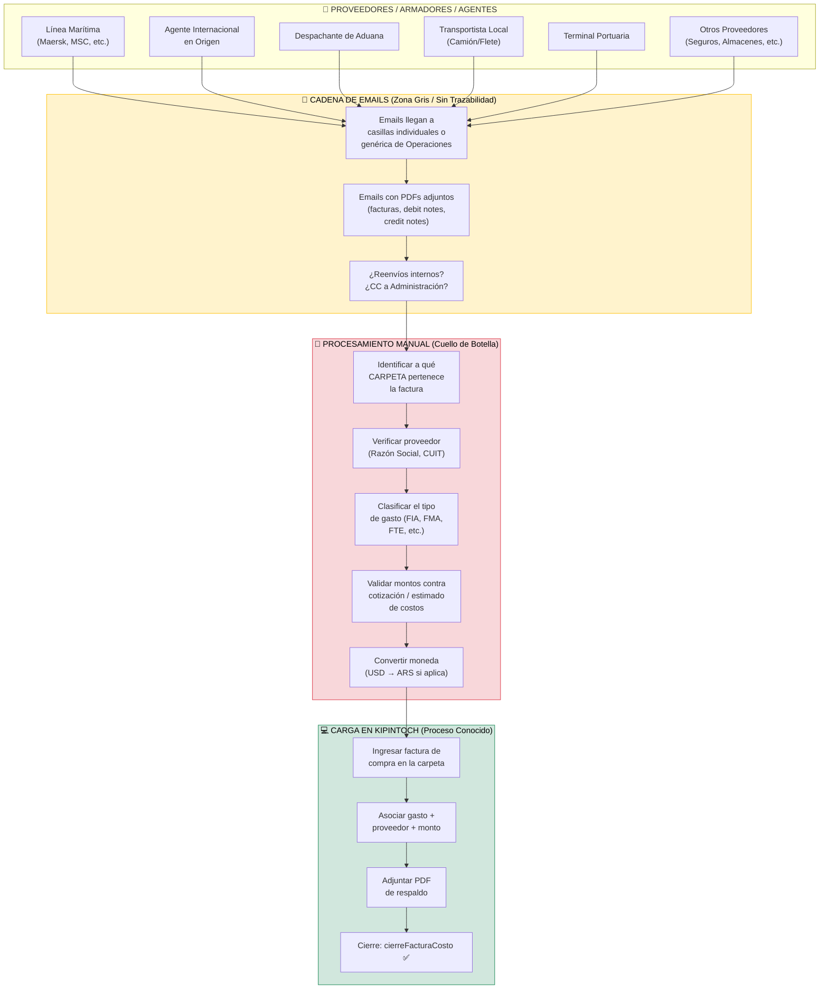
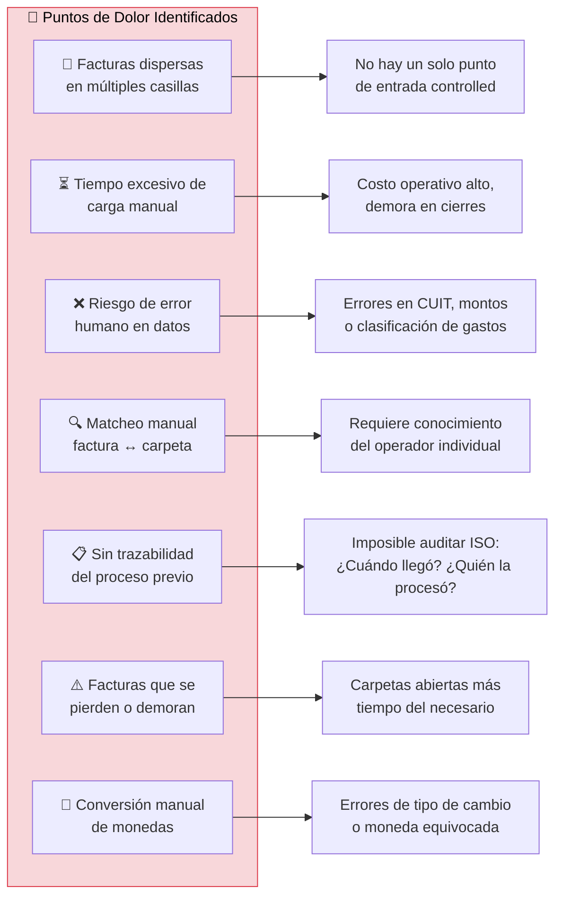
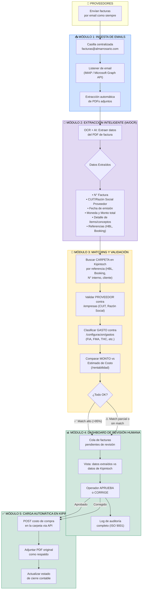
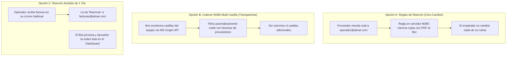
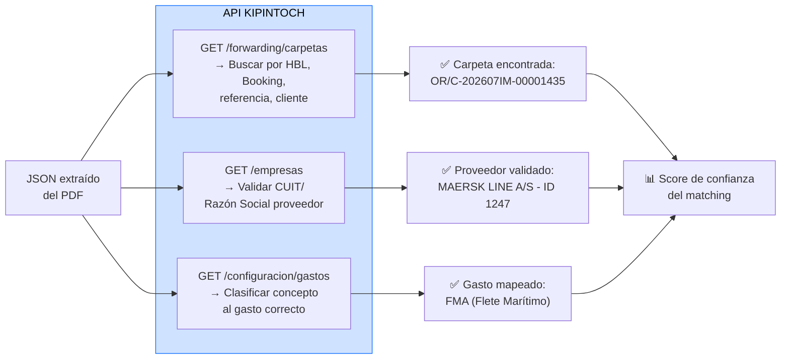
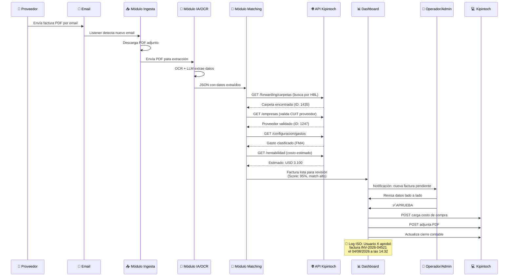
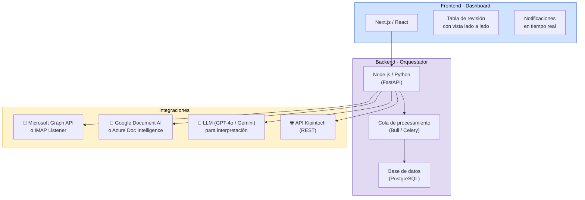
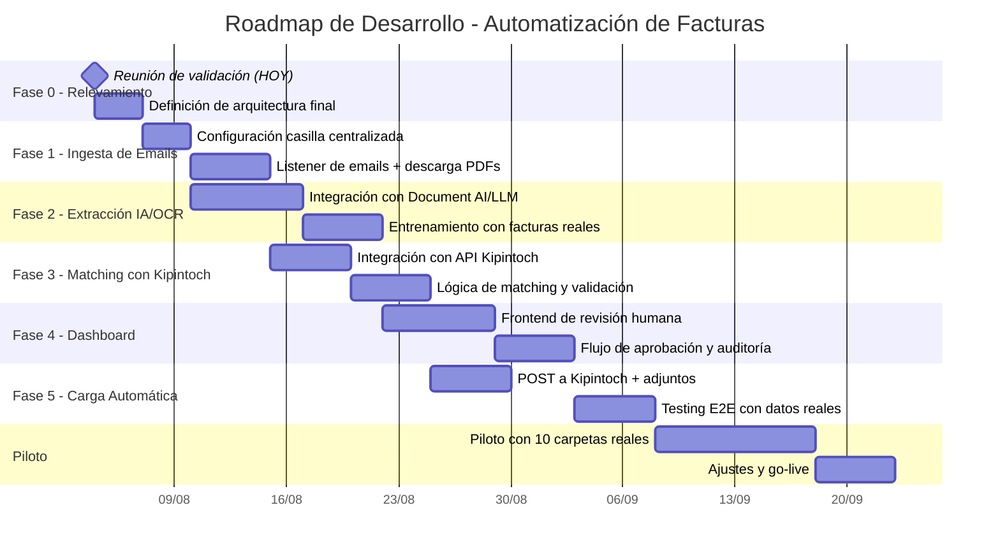

# Automatización de Carga de Facturas — ALMAR Rosario
## Documento de Presentación y Validación de Arquitectura
**Fecha:** 4 de agosto de 2026 | **Versión:** 1.0 | **Proyecto ISO 9001 — Proceso de Apoyo: Administración, Facturación y Finanzas**

---

## 1. Objetivo de esta Reunión

Validar con los referentes de ALMAR el **proceso real actual** de recepción y carga de facturas de proveedores (costos de compra) para:

1. Confirmar o corregir nuestra hipótesis del flujo AS-IS (cómo se hace hoy).
2. Definir los puntos exactos donde entra la automatización.
3. Acordar la arquitectura técnica final para arrancar el desarrollo.

> [!IMPORTANT]
> **El foco está en todo lo que pasa ANTES de que los datos lleguen a Kipintoch.** Una vez que la factura está cargada en el sistema, el flujo es conocido y funciona. El desafío y la oportunidad de automatización están en la cadena previa: mails, PDFs, validaciones manuales y matcheo con carpetas.

---

## 2. Hipótesis del Proceso Actual (AS-IS) — A Validar

### 2.1 Diagrama General del Flujo Actual



### 2.2 Desglose de la "Zona Gris" — Preguntas Clave

La tabla siguiente describe cada paso del proceso previo a Kipintoch tal como lo entendemos. **Necesitamos que los referentes de ALMAR confirmen o corrijan cada fila:**

| # | Paso | Nuestra Hipótesis | ❓ Pregunta para ALMAR |
|:--|:-----|:-------------------|:----------------------|
| 1 | **Recepción de factura** | Los proveedores (armadores, agentes, despachantes, transportistas) envían sus facturas por email como PDFs adjuntos | ¿A qué casilla(s) llegan? ¿Es una genérica tipo `operaciones@almar.com` o van directo al operador asignado? ¿Hay proveedores que usan portal web propio? |
| 2 | **Identificación del destinatario interno** | El email llega a una o varias personas. Alguien decide quién lo procesa | ¿Quién recibe primero? ¿Operador, Customer Service, o Administración directamente? ¿Hay reenvíos? |
| 3 | **Matcheo con carpeta operativa** | Manualmente se busca en Kipintoch la carpeta a la que pertenece la factura, usando datos como N° HBL, booking, nombre del cliente, o referencia | ¿Cómo identifican a qué carpeta corresponde una factura? ¿El proveedor pone alguna referencia de ALMAR en su factura? |
| 4 | **Validación del proveedor** | Se verifica que el proveedor esté dado de alta en Kipintoch con sus datos fiscales correctos (CUIT, Razón Social) | ¿Qué pasa si un proveedor nuevo envía una factura? ¿Quién lo da de alta? |
| 5 | **Clasificación del gasto** | Se determina qué tipo de gasto es (Flete Internacional Aéreo `FIA`, Flete Marítimo `FMA`, Terminal Handling `THC`, etc.) según el nomenclador de Kipintoch | ¿Es siempre claro o hay ambigüedades? ¿Un mismo proveedor puede facturar conceptos distintos en una sola factura? |
| 6 | **Validación de montos** | Se compara el monto facturado contra el costo estimado que ya está cargado en la carpeta (campo `cierreEstimadoCosto`) | ¿Se hace esta validación? ¿Hay un umbral de tolerancia (ej: si la factura difiere más de un X% del estimado, requiere aprobación)? |
| 7 | **Carga en Kipintoch** | Se ingresan manualmente todos los datos en el módulo de costos de la carpeta y se adjunta el PDF | ¿Cuánto tiempo toma cargar UNA factura? ¿Cuántas facturas se cargan por día/semana? |
| 8 | **Cierre contable** | Se activa el cierre `cierreFacturaCosto` cuando todas las facturas de la carpeta están cargadas | ¿Quién autoriza el cierre? ¿Es automático o manual? |

---

## 3. Mapa de Dolor — Dónde Duele Hoy



---

## 4. Proceso Propuesto (TO-BE) — Arquitectura de Automatización

### 4.1 Diagrama de Arquitectura del Sistema Automatizado



### 4.2 Descripción de Cada Módulo

---

#### 📥 Módulo 1: Ingesta de Emails (Manejo de Casillas Descentralizadas)

| Aspecto | Detalle |
|:--------|:--------|
| **Desafío Detectado** | Hoy en ALMAR **no existe una casilla centralizada**. Cada operador se comunica directamente con ciertos proveedores/clientes desde su correo personal. |
| **Solución de Ingesta** | **3 Alternativas Flexibles** (para presentar en la reunión sin forzar cambios de hábito inmediatos en el personal). |
| **Output** | PDF almacenado + metadata del email (remitente, fecha, asunto, cuerpo) |

##### 🛠️ Alternativas para Resolver la Dispersión de Correos:



> [!TIP]
> **Recomendación para ALMAR:** La **Opción A** o **Opción B** son las mejores porque son 100% transparentes para los operadores. No les exige cambiar su forma de comunicarse con clientes y proveedores.

---

#### 🤖 Módulo 2: Extracción Inteligente (IA + OCR)

| Aspecto | Detalle |
|:--------|:--------|
| **Qué hace** | Lee el PDF de la factura y extrae todos los datos estructurados: CUIT, razón social, montos, ítems, referencias, moneda, fecha |
| **Tecnología candidata** | **Google Document AI** o **Azure Document Intelligence** para OCR. Un modelo LLM (GPT-4o / Gemini) para interpretar facturas con formatos no estándar |
| **Desafío principal** | Las facturas de proveedores internacionales (armadores, agentes en el exterior) no tienen formato argentino AFIP. Son invoices/debit notes con formatos muy variados |
| **Output** | JSON estructurado con todos los campos de la factura |

**Ejemplo de output del Módulo 2:**

```json
{
  "numero_factura": "INV-2026-04521",
  "proveedor": {
    "razon_social": "MAERSK LINE A/S",
    "cuit_tax_id": "30-12345678-9",
    "pais": "DK"
  },
  "fecha_emision": "2026-07-28",
  "moneda": "USD",
  "monto_total": 3250.00,
  "items": [
    { "concepto": "Ocean Freight FCL 40HC", "monto": 2800.00 },
    { "concepto": "THC Destination", "monto": 350.00 },
    { "concepto": "BL Fee", "monto": 100.00 }
  ],
  "referencias": {
    "hbl": "MAEURO2607001",
    "booking": "BK920457812",
    "contenedor": "MSKU1234567"
  },
  "confianza_extraccion": 0.92
}
```

---

#### 🔗 Módulo 3: Matching y Validación contra Kipintoch (API)

Este módulo usa **3 endpoints de la API** para validar automáticamente los datos extraídos:



**Lógica de matching de carpeta (prioridad de búsqueda):**

| Prioridad | Campo de búsqueda | Confianza |
|:---------:|:-------------------|:----------|
| 1° | `numeroGuia` (HBL) exacto | 🟢 99% |
| 2° | `numeroBooking` exacto | 🟢 95% |
| 3° | `referenciaExterna` o `referenciaCliente` | 🟡 85% |
| 4° | Combinación `clienteLocal` + `transportista` + fecha | 🟠 70% |
| 5° | Sin match → Cola de revisión manual | 🔴 Requiere humano |

**Validación cruzada contra costo estimado:**

```
GET /rentabilidad?carpeta={id}&agrupamiento=CG&incluyeEstimados=true

Si monto_factura > costo_estimado * 1.10 → ⚠️ Alerta de desvío
Si monto_factura ≈ costo_estimado (±5%) → ✅ Auto-aprobable
```

---

#### 📊 Módulo 4: Dashboard de Revisión Humana

> [!IMPORTANT]
> **Principio de diseño: "Humano en el loop" (Human-in-the-Loop).** El sistema NUNCA carga una factura sin aprobación humana. Pero el trabajo pesado (lectura, matcheo, clasificación) ya está hecho. El humano solo revisa y aprueba/corrige.

**Funcionalidades del dashboard:**

| Feature | Descripción |
|:--------|:------------|
| **Cola de pendientes** | Lista de facturas extraídas esperando aprobación, ordenadas por fecha de recepción |
| **Vista lado a lado** | Columna izquierda: datos extraídos del PDF. Columna derecha: datos de Kipintoch (carpeta, proveedor, gasto esperado) |
| **Indicador de confianza** | 🟢 Match alto (auto-sugerido), 🟡 Match parcial (requiere revisión), 🔴 Sin match (requiere entrada manual) |
| **Botones de acción** | `Aprobar` / `Corregir y Aprobar` / `Rechazar` / `Derivar` |
| **Log de auditoría** | Registro inmutable: quién aprobó, cuándo, qué corrigió. **Cumple ISO 7.5 (Control de Información Documentada)** |
| **Métricas en tiempo real** | Facturas procesadas hoy, pendientes, tiempo promedio de procesamiento, tasa de match automático |

---

#### ✅ Módulo 5: Carga Automática en Kipintoch

Una vez aprobada, el sistema ejecuta:

```
1. POST costo de compra en la carpeta (via API Kipintoch)
   → Asocia: carpeta + proveedor + gasto + monto + moneda

2. POST adjunto (PDF original de la factura)
   → /adjuntos/obtener (entidadRelacionada: Carpeta)

3. Actualizar estado de cierre contable
   → cierreFacturaCosto = ✅
```

---

## 5. Diagrama de Secuencia Completo (End-to-End)



---

## 6. Stack Tecnológico Propuesto



---

## 7. Preguntas que NECESITAMOS Responder Mañana

> [!CAUTION]
> Sin estas respuestas, **no podemos definir la arquitectura final ni arrancar el desarrollo.** Son bloqueantes.

### 🔴 Prioridad Máxima (Bloqueantes)

| # | Pregunta | Impacto en la Arquitectura |
|:--|:---------|:---------------------------|
| 1 | **¿Qué sistema de email usan?** (Outlook 365, Gmail, otro) | Define si usamos Microsoft Graph API o IMAP |
| 2 | **¿A cuántas casillas distintas llegan facturas hoy?** ¿Quién las recibe? | Define la estrategia de centralización o multi-casilla |
| 3 | **¿Cómo identifican hoy a qué carpeta pertenece una factura?** ¿Qué dato usan? (HBL, booking, nombre del cliente, "lo saben de memoria") | Define la lógica de matching automático |
| 4 | **¿Existen facturas de proveedores del exterior** (invoices en inglés, sin formato AFIP)? ¿Qué % representan? | Define la complejidad del OCR/IA necesaria |
| 5 | **¿Cuántas facturas de compra se procesan por semana/mes?** | Define el dimensionamiento del sistema |

### 🟡 Prioridad Alta (Diseño)

| # | Pregunta | Impacto |
|:--|:---------|:--------|
| 6 | **¿Un proveedor puede incluir múltiples conceptos/gastos en una sola factura?** | Lógica de split de ítems |
| 7 | **¿Hay facturas que aplican a VARIAS carpetas a la vez?** (ej: un flete consolidado para 3 clientes) | Lógica de prorrateo |
| 8 | **¿Quién tiene la autoridad para aprobar la carga?** ¿Operador, Administración, ambos? | Flujo de aprobación en el dashboard |
| 9 | **¿Existe un proceso de carga de costos ESTIMADOS antes de recibir la factura real?** | Validación de desvíos automática |
| 10 | **¿Hay proveedores que ya envían facturas electrónicas** (XML de AFIP, e-factura)? | Podríamos parsear directo sin OCR |

### 🟢 Prioridad Media (Optimización Futura)

| # | Pregunta | Impacto |
|:--|:---------|:--------|
| 11 | ¿Usan Shipgoals, AIS u otros sistemas además de Kipintoch para tracking? | Integraciones futuras |
| 12 | ¿Hay un proceso de reclamo si la factura no coincide con lo cotizado? | Workflow de excepciones |
| 13 | ¿Cuántos usuarios cargarían facturas simultáneamente? | Concurrencia del dashboard |

---

## 8. Beneficios Esperados — ROI de la Automatización

| Métrica | Hoy (Manual) | Con Automatización | Mejora |
|:--------|:-------------|:-------------------|:-------|
| **Tiempo de carga por factura** | ~10-15 min | ~1-2 min (revisión) | **85% reducción** |
| **Trazabilidad del proceso previo** | ❌ Inexistente | ✅ Log completo (ISO) | **100% cobertura** |
| **Errores de carga** | Alto (CUIT, monto, gasto) | Mínimo (validación cruzada) | **~90% reducción** |
| **Facturas perdidas/demoradas** | Ocurre regularmente | Alertas automáticas | **Eliminación** |
| **Tiempo de cierre de carpeta** | Depende de personas | Depende del sistema | **Predecible** |
| **Cumplimiento ISO 7.5** | Parcial | Total (registros inmutables) | **Certificable** |

---

## 9. Roadmap de Desarrollo Propuesto



---

## 10. Alineación con ISO 9001 — Proceso de Apoyo

Este sistema de automatización cubre directamente los requisitos del SGC para el proceso de **Administración, Facturación y Finanzas** del [Mapa de Procesos ALMAR V0](file:///C:/Users/franc/Downloads/Mapa_de_Procesos_ALMAR_V0.pdf):

| Requisito ISO 9001:2015 | Cómo lo Cumple la Automatización |
|:-------------------------|:---------------------------------|
| **7.5** Control de Información Documentada | Log inmutable de cada factura: cuándo llegó, quién la procesó, qué datos se extrajeron, quién la aprobó |
| **8.1** Planificación y Control Operacional | Proceso estandarizado y repetible, elimina variabilidad humana |
| **8.4** Control de Procesos Suministrados Externamente | Validación automática de proveedores contra padrón maestro de Kipintoch |
| **8.5.2** Identificación y Trazabilidad | Cada factura vinculada unívocamente a una carpeta operativa con ID único |
| **9.1** Seguimiento, Medición, Análisis y Evaluación | Dashboard con métricas en tiempo real: volumen, tiempos, errores, desvíos |
| **10.2** No Conformidad y Acción Correctiva | Alertas automáticas de desvíos de costo, facturas sin match, proveedores no registrados |

---

## 11. Guía Práctica de Dibujo en Pizarra para la Reunión

Para hacer la reunión dinámica e interactiva con los encargados de ALMAR, se recomienda dibujar la solución en la pizarra en **3 pasos secuenciales**:

### 🎨 Esquema de Dibujo en 3 Pasos:

```
  PASO 1: Dibujar el "Antes"           PASO 2: Dibujar el "Puente"            PASO 3: Matriz Viva
┌───────────────────────────────┐     ┌───────────────────────────────┐     ┌───────────────────────────────┐
│ 📧 Mails ➔ 👤 Tipeo ➔ 💻 Kipin│ ➔   │ 📥 Auto ➔ 🤖 IA ➔ 🖥️ 1-Clic   │ ➔   │ [Proveedor] [Dato Clave] [OK] │
└───────────────────────────────┘     └───────────────────────────────┘     └───────────────────────────────┘
```

1. **Paso 1: Dibujar el "Antes" (AS-IS):**
   - Esquematizar: `[ 📧 Mails / PDFs ] ➔ [ 👤 Tipeo Manual ] ➔ [ 💻 Kipintoch ]`.
   - Preguntarles: *¿Cuántas casillas reciben facturas hoy? ¿Qué pasa si un mail queda traspapelado o el operador está de licencia?*
2. **Paso 2: Dibujar el "Puente" (La Solución Asistida):**
   - Esquematizar: `[ 📥 Casilla/API ] ➔ [ 🤖 IA/OCR ] ➔ [ 🖥️ Pantalla 1-Clic ] ➔ [ 💻 Kipintoch ]`.
   - Explicar la regla: *"El bot hace el 90% del trabajo pesado. El operador solo mira la pantalla, confirma con 1 clic y Kipintoch se actualiza solo."*
3. **Paso 3: Matriz Viva de Trabajo:**
   - Dibujar la tabla de proveedores en la derecha de la pizarra y completar con ellos:
     - *Armadores (Maersk/MSC)* ➔ *Factura por Email PDF* ➔ *Dato Clave: Booking / HBL*.
     - *Despachantes* ➔ *Factura por Email PDF* ➔ *Dato Clave: Registro María / Despacho*.
     - *Fletes Locales* ➔ *Email / WhatsApp* ➔ *Dato Clave: CUIT / Cliente*.
