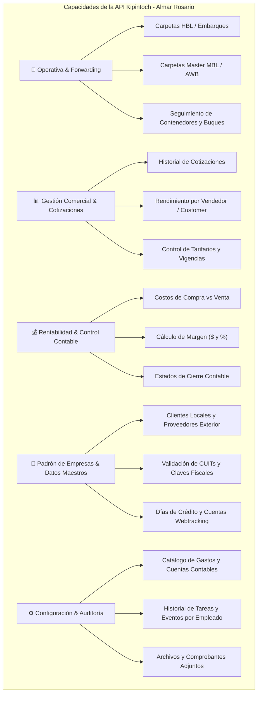
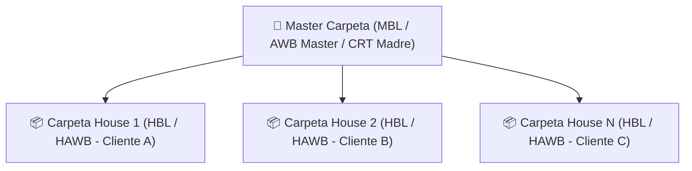

# Reporte de Capacidades y Mapa de Datos: API Kipintoch (Almar Rosario)

Este documento describe de manera exhaustiva la arquitectura de datos, procesos de negocio e información relevante accesible a través de la API oficial del sistema **Kipintoch / KipinCARGO** para **Almar Rosario**. Ha sido estructurado específicamente para servir de insumo técnico en los procesos de **automatización de carga de facturas** y en la **implementación y auditoría de normas ISO** (gestión de calidad, trazabilidad y control de procesos).

---

## 1. Resumen Ejecutivo y Contexto de Auditoría ISO

El sistema Kipintoch cuenta con una API RESTful alojada en la infraestructura exclusiva de la empresa (`https://api.almarrosar.kipincargo.com`). 

Desde la perspectiva de **Normas ISO (Gestión de Calidad y Procesos)**, la API garantiza tres pilares fundamentales:
1. **Trazabilidad de Extremo a Extremo:** Registro inmutable de creación, modificación, asignación de usuarios y estados de avance de cada operación logística.
2. **Control Cero Error:** Capacidad de homologación de datos maestros (Clientes, CUITs, Conceptos de Gastos, Monedas).
3. **Consistencia Financiera:** Vinculación directa entre el costo del proveedor, el precio de venta al cliente y el margen de ganancia calculado.

---

## 2. Mapa de Procesos de Negocio e Información Accesible

---

## 3. Detalle por Módulo de Negocio

### 🚢 A. Módulo Operativo (Forwarding y Embarques) - Detalle Profundo

El módulo operativo es el corazón de Kipintoch y gestiona el ciclo de vida completo del transporte de carga internacional desde la solicitud hasta la llegada a destino final.

#### 1. Arquitectura Jerárquica: Master vs. House (Contratos de Transporte)

* **Master Carpeta (`MasterCarpeta`):** `GET /forwarding/mastercarpetas`
  * Representa el consolidador o contrato principal con la línea marítima, aerolínea o empresa de transporte internacional (ej. Maersk, MSC, Lufthansa, Prontolog).
  * **Datos clave:** N° de Master/MBL, Agente en Origen, Armador/Transportista, Buque/Vuelo, Tipo de Servicio Marítimo (FCL/LCL), Contenedores consolidados y Usuario operativo asignado.
* **Carpeta House (`Carpeta`):** `GET /forwarding/carpetas`
  * Representa la operación individual y contrato específico emitido para el cliente de Almar Rosario.
  * **Identificadores:** `numeroInterno` (ej: `OR/C-202607IM-00001435`), N° de Guía/HBL (`numeroGuia`), N° Booking (`numeroBooking`), Referencia Interna (`referenciaInterna`), Referencia Externa (`referenciaExterna`) y Referencia del Cliente (`referenciaCliente`).

---

#### 2. Clasificación de Operaciones y Modos Logísticos

La API clasifica cada carpeta operativa mediante dos ejes obligatorios:

* **Área (`area`):**
  * `M` = Marítimo
  * `A` = Aéreo
  * `T` = Terrestre
  * `D` = Despacho de Aduana
  * `V` = Vacío / Servicios Auxiliares
* **Sector (`sector`):**
  * `I` = Importación
  * `E` = Exportación
  * `L` = Tráfico Local / Nacional
  * `V` = Vacío
* **Modalidad de Carga (`tipoOperacion`):**
  * `FCL / FCL` (Contenedor Completo)
  * `LCL / LCL` (Carga Consolidada)
  * `FTL` (Camión Completo) / `LTL` (Camión Consolidado)
  * `Paletizado` / `Carga Suelta` / `OOG` (Out of Gauge)

---

#### 3. Matriz de Actores y Roles Asignados

Por cada carpeta operativa, la API registra explícitamente a los responsables internos y externos:

| Rol en API | Descripción / Función |
| :--- | :--- |
| **`clienteLocal`** | Empresa o cliente final en Argentina que contrata el servicio logístico. |
| **`entidadExterior`** | Exportador / Vendedor en origen (Shipper) o Consignatario en el exterior. |
| **`transportista`** | Empresa de transporte (Línea Marítima, Aerolínea o Camión) que mueve la carga. |
| **`agente`** | Agente de carga internacional en origen o destino. |
| **`agenteAduanal`** | Despachante de Aduana interviniente. |
| **`vendedor`** | Ejecutivo comercial de Almar Rosario asignado a la operación. |
| **`customer`** | Representante de atención al cliente / seguimiento asignado. |
| **`operador` / `documentador`** | Personal operativo a cargo del armado de documentación. |
| **`usuarioCreador`** | Usuario que dio de alta la carpeta en el sistema con timestamp. |

---

#### 4. Trazabilidad Temporal y Cronograma de Fechas (Control ISO)

La API almacena una línea de tiempo completa para auditar desvíos y tiempos de tránsito:

* **Fechas de Gestión:**
  * `fechaEmision`: Fecha de alta formal de la carpeta.
  * `fechaCreacion`: Timestamp exacto del registro inicial.
* **Trazabilidad de Tránsito:**
  * `fechaSalida` (ETD) vs. `fechaRealSalida` (ATD - Actual Time of Departure).
  * `fechaLlegada` (ETA) vs. `fechaRealLlegada` (ATA - Actual Time of Arrival).
* **Control de Plazos Críticos (Cut-off Dates):**
  * `cutOffDoc` (Límite para entrega de documentación).
  * `cutOffFisico` (Límite para ingreso de carga a terminal/puerto).
  * `cutOffImo` (Límite para cargas peligrosas IMO).
  * `cutOffVgm` (Límite de verificación de peso bruto de contenedor).
* **Transbordos y Escalas:**
  * Fechas estimadas y reales de llegada/salida en terminales de transbordo, buque de transbordo y viaje.

---

#### 5. Datos Físicos de Carga, Equipamiento y Aduana

* **Métricas de Carga:** Cantidad de Bultos (`bultos`), Peso Real (`peso` en Kg), Peso Aforado (`pesoAforado`), Volumen (`volumen` en $m^3$) y Tonelada/M3.
* **Equipamiento y Mercadería:**
  * `listaCantidadContenedores`: Listado e identificación de contenedores asignados.
  * `nombresMercaderias`: Descripción de la mercadería transportada.
  * `incoterm`: Término de negociación internacional (FOB, CIF, CFR, EXW, DDP, etc.).
* **Vinculación Aduanera (`carpetaAduana`):**
  * Conexión directa con la declaración aduanera: N° de Registro María (`numeroMaria`) y N° de Despacho (`numeroDespacho`).

---

---

### 📊 B. Módulo Comercial y Cotizaciones
* **Endpoint Principal:** `GET /estadisticaComercial`
* **Información Accesible:**
  * **Asignación de Personal:** Vendedor responsable, Customer Service asignado, Operador y Usuario Creador.
  * **Embudo Comercial:** Cotizaciones generadas, vigencias (desde/hasta), estados (`P` Pendiente, `T` Tramitada, `A` Aceptada).
  * **Volúmenes Operados:** Agregado de kilos, TEUs, bultos y tipo de operación (`FCL/FCL`, `LCL/LCL`, `FTL`, etc.).

---

### 💰 C. Módulo Financiero, Facturación y Rentabilidad
* **Endpoint Principal:** `GET /rentabilidad`
* **Información Accesible:**
  * **Apertura de Margen por Carpeta y Gasto:**
    * **Venta:** Monto facturado al cliente.
    * **Costo:** Monto real facturado por el proveedor o armador.
    * **Margen de Ganancia ($):** Resultado neto por concepto de gasto.
    * **Porcentaje de Margen (%):** Calculado como `(Margen / Venta) * 100`.
  * **Multimoneda:** Desglose en Moneda Origen, Moneda Local (ARS) y Segunda Moneda (USD).
  * **Matriz de Cierres Contables (Control ISO):**
    * `cierreEstimadoCosto` (Carga inicial de costos esperados)
    * `cierreFacturaCosto` (Factura de compra auditada e ingresada)
    * `cierrePrefacturaVenta` (Borrador de facturación emitido)
    * `cierreFacturaVenta` (Factura definitiva emitida al cliente)
    * `cierreCobranza` / `cierrePagos` (Control de tesorería)
    * `cierreOperativo` (Operación cerrada para auditoría)

---

### 👥 D. Módulo de Empresas y Datos Maestros
* **Endpoint Principal:** `GET /empresas` & `GET /empresas/listadoClavesTributarias`
* **Información Accesible:**
  * **Ficha de Empresa:** Razón Social, Nombre Comercial, CUIT/Clave Tributaria, Domicilio Fiscal, Ciudad, Provincia, País.
  * **Categorización:** Clasificación fiscal (Responsable Inscripto, Exento, etc.), Vendedor y Customer asignados.
  * **Condiciones Comerciales:** Días de crédito autorizados, vigencia de carta de garantía y usuarios habilitados en Webtracking.

---

### ⚙️ E. Módulo de Configuración, Gastos y Auditoría de Tareas
* **Endpoints Principales:** `GET /configuracion/gastos`, `GET /status`, `GET /adjuntos/obtener`
* **Información Accesible:**
  * **Nomenclador de Gastos:** Código de gasto (`FIA`, `FMA`, etc.), Nombre, Sector, Área y Cuentas Contables asociadas (Ingreso/Egreso).
  * **Auditoría de Acciones/Status:** Historial de eventos, notas internas y tareas pendientes registradas por usuario.
  * **Archivos Adjuntos:** Identificación y descarga de documentos de respaldo asociados a carpetas.

---

## 4. Especificaciones Técnicas para Integración y Automatización

| Parámetro | Especificación |
| :--- | :--- |
| **URL Base Backend:** | `https://api.almarrosar.kipincargo.com` |
| **Código Agencia:** | `ALMARROS` |
| **Autenticación:** | Header HTTP `token: <API_TOKEN>` o Query String `?token=<API_TOKEN>` |
| **Formato de Datos:** | JSON (UTF-8) |
| **Arquitectura:** | RESTful |

---

> [!NOTE]
> Este mapa de capacidades demuestra que el sistema cuenta con la estructura necesaria para soportar tanto la automatización del flujo de carga de facturas vía mail como el cumplimiento de los estándares de trazabilidad exigidos por la norma **ISO 9001**.
